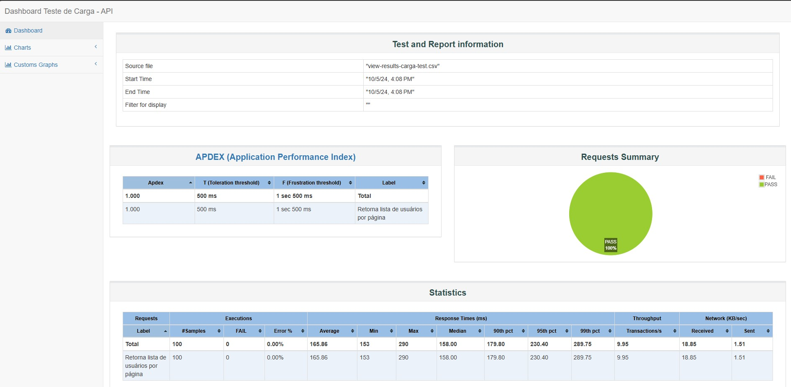

# Relatório de testes do Jmeter

Relatório gerado pelo Jmeter com dados dos testes de carga e estresse da API https://reqres.in/.


## Visualizar o dashboard

Para visualizar os dashboards, você deve entrar no projeto desejado e abrir o arquivo index.html

Caminho:
```bash
  teste-carga > index.html
  teste-estresse > index.html
```


## Screenshots




## Autor

- [@lucasilvadrm](https://www.github.com/lucasilvadrm)

